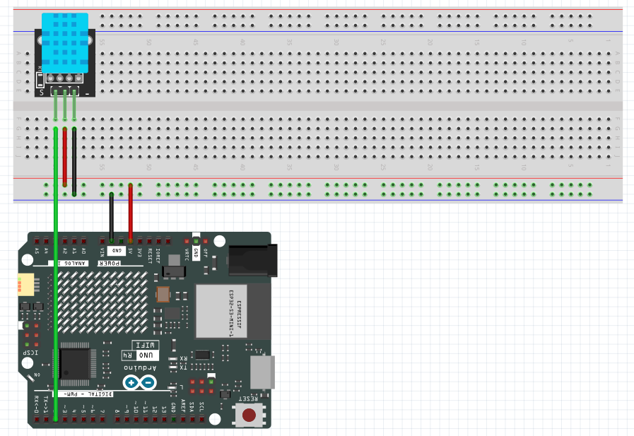

# oneM2M 온습도 센서 예제

## 개요

DHT11 센서로 측정한 온습도 데이터를 iot-coss의 oneM2M 플랫폼(Mobius)에 전송하는 예제입니다. Arduino R4 WiFi의 내장 LED 매트릭스에 실시간 온습도를 표시하며, HTTPS를 통해 oneM2M 리소스를 생성하고 데이터를 업로드합니다.

## 필요한 부품

- Arduino UNO R4 WiFi
- DHT11 온습도 센서
- 점퍼 케이블

## 배선 연결



- DHT11 데이터 핀 → Arduino 디지털 핀 2번
- DHT11 VCC → 5V (브레드보드 +)
- DHT11 GND → GND (브레드보드 -)

## 필요한 라이브러리

Arduino IDE 라이브러리 매니저에서 다음 라이브러리를 설치하세요:

- **DHT sensor library** (by Adafruit)
- **ArduinoJson** (by Benoit Blanchon)
- **Arduino_LED_Matrix** (내장 라이브러리)
- **WiFiS3** (내장 라이브러리)

## 설정 파일 (secrets.h)

`secrets.h` 파일을 생성하고 다음 내용을 입력하세요:

```cpp
#define SECRET_SSID "your_wifi_ssid"
#define SECRET_PASS "your_wifi_password"
#define API_KEY "your_api_key"
#define LECTURE "your_lecture_code"
#define CREATOR "your_name"
```

- WiFi SSID와 비밀번호를 입력합니다.
- iot-coss 플랫폼에서 발급받은 API_KEY, LECTURE, CREATOR 정보를 입력합니다.

## oneM2M 리소스 구조

이 예제는 다음과 같은 oneM2M 리소스 계층을 생성합니다:

```text
/Mobius (CSEBase)
  └── R4_TUTO (AE - Application Entity)
       ├── TEM (CNT - Container, 온도 데이터)
       │    └── CIN (ContentInstance, 온도 값)
       └── HUM (CNT - Container, 습도 데이터)
            └── CIN (ContentInstance, 습도 값)
```

## 코드 설명

### 주요 기능

1. **WiFi 연결**: 설정된 WiFi 네트워크에 연결합니다.
2. **리소스 초기화** (`setDevice()`):
   - AE(Application Entity) 확인 및 생성
   - TEM, HUM CNT(Container) 확인 및 생성
   - GET 요청으로 존재 확인 → 404/403이면 POST로 생성
3. **센서 데이터 수집**: DHT11에서 온습도 측정
4. **LED 매트릭스 표시**: 온도(왼쪽), 습도(오른쪽) 표시
5. **데이터 전송**: CIN(ContentInstance) 생성으로 oneM2M 플랫폼에 데이터 업로드

### 핵심 함수

- `ensureWifiConnected()`: WiFi 연결 확인 및 재연결
- `setDevice()`: AE 및 CNT 리소스 확인/생성
- `get()`: oneM2M GET 요청 (리소스 조회)
- `post()`: oneM2M POST 요청 (리소스 생성)
- `serializeJsonBody()`: oneM2M JSON 요청 본문 생성
- `displayTemperatureHumidity()`: LED 매트릭스에 온습도 표시

### 리소스 생성 로직

```cpp
// 1. AE 확인 -> 없으면 생성
int aeSc = get(aePath);
if (aeSc == 404 || aeSc == 403) {
  post(CSEBASE, "AE", AE_RN, "");
}

// 2. TEM CNT 확인 -> 없으면 생성
int temSc = get(temPath);
if (temSc == 404 || temSc == 403) {
  post(aePath, "CNT", TEM_CNT, "");
}

// 3. HUM CNT 확인 -> 없으면 생성
int humSc = get(humPath);
if (humSc == 404 || humSc == 403) {
  post(aePath, "CNT", HUM_CNT, "");
}
```

## 실행 방법

1. `secrets.h` 파일을 생성하고 WiFi 및 플랫폼 정보를 입력합니다.
2. Arduino IDE에서 `oneM2M_DT11.ino` 파일을 엽니다.
3. DHT11 센서를 Arduino에 연결합니다.
4. 보드와 포트를 선택합니다 (Tools > Board > Arduino UNO R4 WiFi).
5. 업로드 버튼을 클릭하여 코드를 업로드합니다.
6. 시리얼 모니터를 열어 (115200 baud) 연결 상태 및 데이터 전송을 확인합니다.
7. iot-coss 플랫폼에 로그인하여 생성된 리소스와 데이터를 확인합니다.

## 예상 출력

시리얼 모니터:

```text
[WiFi] Connecting to SSID: YourWiFi
[WiFi] Connected.

[SETUP] Complete. Entering loop...

[TRY] GET CB (CSEBase) ...
[CB] HTTP status = 200

Setup Started!
[setDevice] AE exists
[setDevice] TEM CNT exists
[setDevice] HUM CNT exists
Setup completed!
----------------------
TEM: 24.00 °C
HUM: 65.00 %
----------------------
[POST] Sending state to server...
[POST CIN] HTTP=201
[POST CIN] HTTP=201
```

## 플랫폼에서 확인

[https://platform.iotcoss.ac.kr](https://platform.iotcoss.ac.kr)에 접속하여:

내 데이터 목록 -> 리소스 트리 에서 확인가능합니다.

## 주의사항

- WiFi 연결 후 네트워크 스택 안정화를 위해 5초 대기합니다.
- 첫 번째 TLS 연결이 실패할 수 있으나, `loop()`에서 재시도하므로 정상 동작합니다.
- DHT11은 최소 2초 간격으로 읽어야 하므로 `DELAY`는 10000ms(10초)로 설정되어 있습니다.
- oneM2M 플랫폼의 API_KEY, LECTURE, CREATOR 정보가 올바르지 않으면 오류가 발생합니다.
